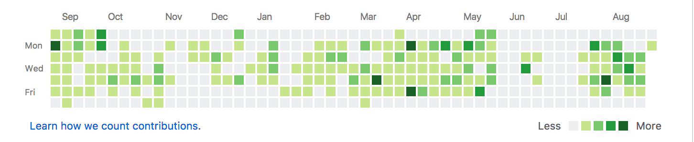
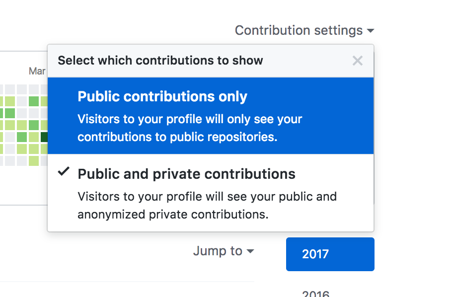

# GitHub Green Boxes

## Do you have them?
This is what they look like. They should be showing up on your profile of your GitHub page.

## Private and Public Repo Contributions
Check that both contributions to public and private repos are showing.

## Set your correct email in local config
- [https://help.github.com/articles/setting-your-email-in-git/](https://help.github.com/articles/setting-your-email-in-git/)
- [https://git-scm.com/docs/git-config](https://git-scm.com/docs/git-config)
- [https://help.github.com/articles/changing-author-info/](https://help.github.com/articles/changing-author-info/)
