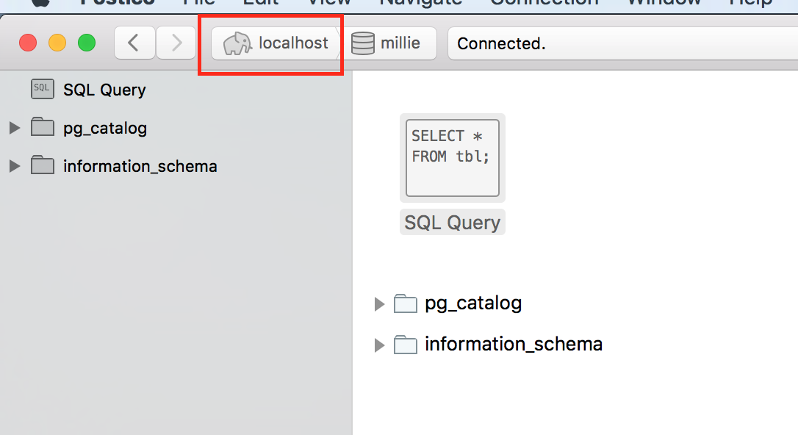
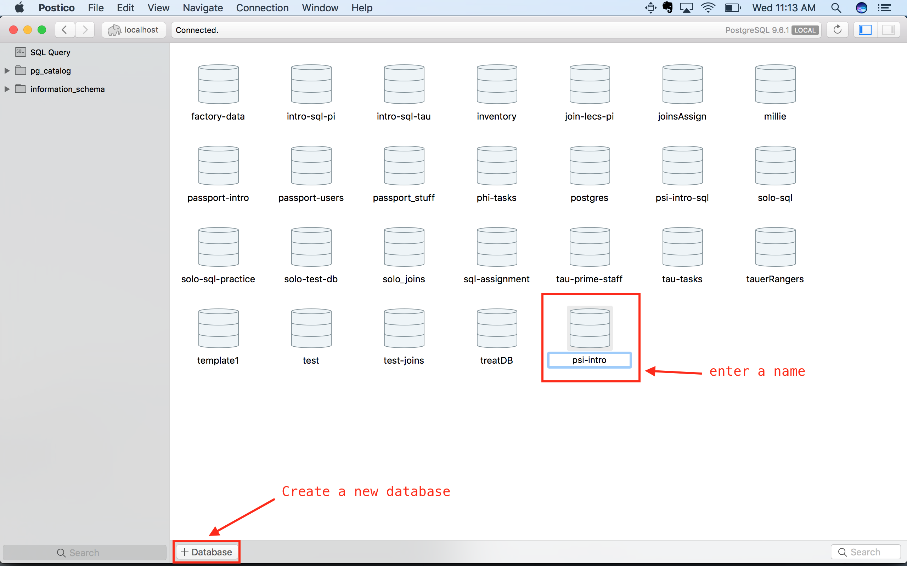
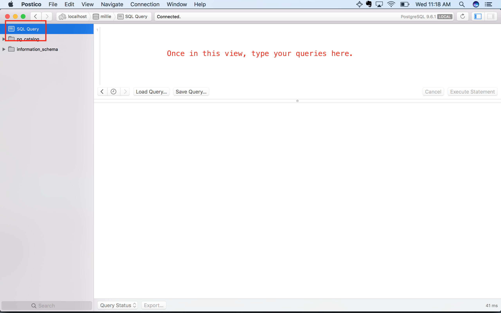
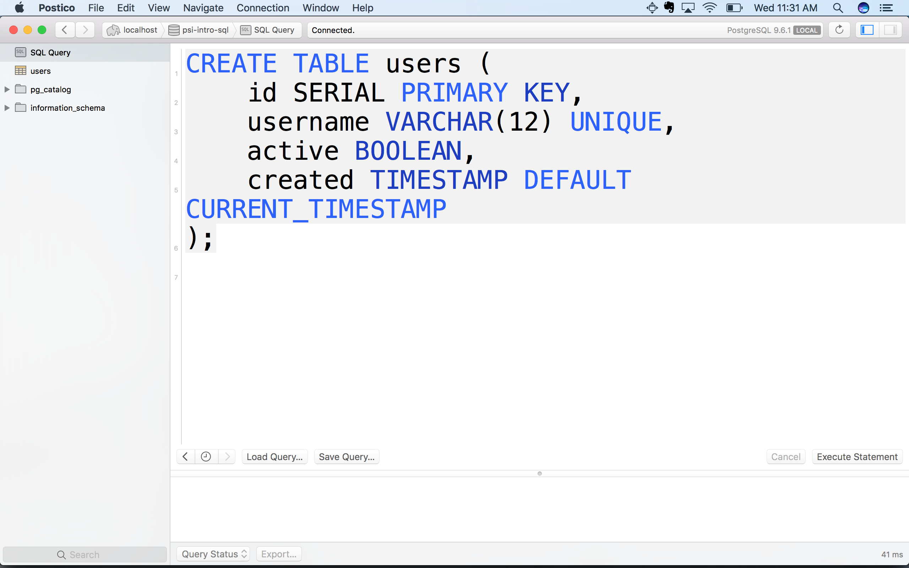
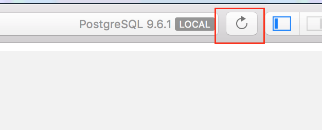

# How to Run Queries in Postico

1. Open postico
2. Connect to the localhost db. See image below, connect button outlined in red.

3. Go to home menu via the localhost button with an elephant on it. See image below outlined in red.

4. Create a new database and name it.

5. Double click on the database you created to open it.
6. Click the SQL Query tab on the left side to enter the query window. 

7. Type any queries into this window.

8. Don't forget to refresh in postico to see the results of your queries update. 

